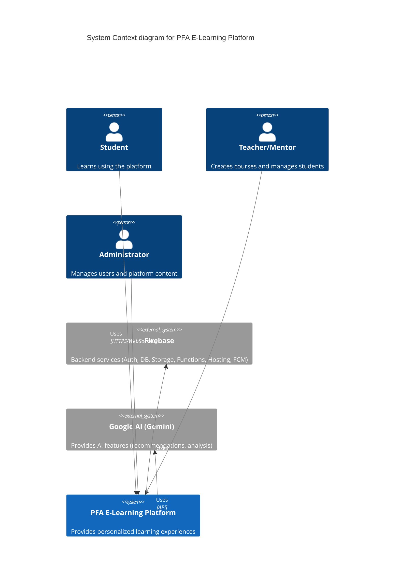

# PFA - Your Personalized E-Learning Adventure 🚀

**PFA** is an open-source e-learning platform designed to empower learners and educators through personalized learning paths, interactive modules, and Firebase-powered real-time features.

### Badges
[](https://img.shields.io/badge/version-v1.0.0-green)
[](LICENSE)
[](https://firebase.google.com/)
[](https://nextjs.org/)

## 🏛️ System Context (C4 Model)

This diagram shows the high-level context of the PFA platform, its users, and key external system dependencies.



## ✨ Platform Features

### For Students
- **Sign up & Sign in** - Secure authentication with multiple provider options
- **Search** - Find relevant courses based on interests and skill level
- **Notifications** - Stay updated with course changes and announcements
- **Interactive Dashboard** - Track progress and manage enrolled courses
- **Course Management** - Enroll in or drop courses with ease
- **Assessment System** - Schedule/reschedule tests to fit your learning pace
- **Performance Analytics** - Review your learning journey with detailed metrics
- **Rating and Reviews** - Share feedback with the community

### For Teachers/Mentors
- **Course Management** - Create and update courses with modular content
- **Resource Uploads** - Share learning materials in various formats
- **Assessment Tools** - Create quizzes and grade student work
- **Interactive Forums** - Engage with students through discussions
- **Live Sessions** - Host real-time teaching sessions
- **Certification** - Approve course completion for students

### For Administrators
- **User Management** - Oversee student and teacher accounts
- **Course Oversight** - Monitor and manage platform content
- **Push Notifications** - Send targeted announcements
- **Analytics Dashboard** - Generate reports on platform usage and performance
- **Moderation Tools** - Maintain community standards

### AI-Powered Features
- **Sentiment Analysis** - Analyze forum posts to maintain positive community interactions
- **Study Topic Suggestions** - Get AI-generated learning recommendations (via Genkit Flows)
- **Language Detection** - Automatically identify content language
- **Chatbot Assistant** - 24/7 help for common questions
- **Personalized Recommendations** - AI-curated course suggestions
- **Vector Search** - Enhanced course discovery using embeddings

## 🔥 Firebase Integration

PFA leverages Firebase's powerful features to create a seamless learning experience:

- **Authentication** - Multi-provider login with secure role management
- **Firestore Database** - Real-time data synchronization for instant updates
- **Storage** - Secure file management for course resources
- **Cloud Functions** - Serverless backend for AI features (Genkit Flows), notifications, and background tasks
- **Cloud Messaging (FCM)** - Push notifications across devices
- **Security Rules** - Granular access control for Firestore and Storage
- **Hosting** - Global content delivery for the Next.js frontend
- **Offline Mode** - Continue learning even without internet connection (via Firestore persistence and local caching)

## 🚀 Getting Started

### Prerequisites
- Node.js v18 or higher (required by some dependencies like Genkit)
- npm or yarn
- Firebase CLI (logged in: `firebase login`)
- Firebase project (Blaze plan recommended for Cloud Functions beyond free tier)

### Installation

1.  Clone the repository:
    ```bash
    git clone https://github.com/yourusername/PFA.git
    cd PFA
    ```

2.  Install frontend dependencies:
    ```bash
    npm install
    ```

3.  Install backend dependencies (Firebase Functions):
    ```bash
    cd functions
    npm install
    cd ..
    ```

4.  Configure Firebase:
    *   Create a Firebase project at [firebase.google.com](https://firebase.google.com/)
    *   Enable Authentication (Email/Password, Google, GitHub), Firestore, Storage, and Functions.
    *   Set up Firestore in Native mode.
    *   Add a Web App to your Firebase project.
    *   Copy your Firebase config details into `.env.local` in the project root:
        ```dotenv
        # Firebase Client SDK Config
        NEXT_PUBLIC_FIREBASE_API_KEY=your_api_key
        NEXT_PUBLIC_FIREBASE_AUTH_DOMAIN=your_auth_domain
        NEXT_PUBLIC_FIREBASE_PROJECT_ID=your_project_id
        NEXT_PUBLIC_FIREBASE_STORAGE_BUCKET=your_storage_bucket
        NEXT_PUBLIC_FIREBASE_MESSAGING_SENDER_ID=your_sender_id
        NEXT_PUBLIC_FIREBASE_APP_ID=your_app_id

        # Optional: Add Google AI API Key if needed directly by client
        # NEXT_PUBLIC_GEMINI_API_KEY=your_gemini_api_key
        ```
    *   **Important:** Ensure your Firebase Functions have access to Google AI services. This might involve enabling necessary APIs (like Vertex AI or AI Platform) in your Google Cloud project associated with Firebase and potentially setting environment variables for the functions if using API keys directly (though service account permissions are generally preferred).

5.  Set up Firebase Emulators (Recommended for Local Development):
    *   Run `firebase init emulators` and select Auth, Firestore, Functions, Storage, and Pub/Sub. Choose default ports or configure as needed.
    *   Download emulators if prompted.

6.  Start the development server and emulators:
    *   For a clean start: `npm run emulators`
    *   For development with seeded data (if you've run `npm run emulators:export` before): `npm run emulators:seeded`
    *   In a separate terminal, start the Next.js app: `npm run dev`

7.  Visit [http://localhost:3000](http://localhost:3000) to see your app. Emulator UI is usually at [http://localhost:4000](http://localhost:4000).

## 🛠️ Technology Stack

### Frontend
- **Next.js 15** - React framework with server-side rendering & App Router
- **React 19** - UI component library
- **Material UI 7** - Component design system
- **Firebase SDK (v11+)** - Firebase web client
- **React Query (Tanstack Query v5)** - Data fetching and caching
- **Zustand** - Lightweight state management
- **React Hook Form** - Form handling and validation (with Zod resolver)
- **TipTap** - Rich text editor

### Backend (Firebase Services)
- **Firebase Authentication** - User management & Role-based access control (RBAC via Custom Claims)
- **Firestore** - NoSQL database with real-time sync & offline persistence
- **Firebase Storage** - File management for course resources
- **Firebase Functions (Node.js)** - Serverless computing for backend logic, notifications, scheduled tasks
- **Firebase Hosting** - Website hosting with CDN
- **Firebase Cloud Messaging (FCM)** - Push notifications

### AI Integration
- **Genkit (Firebase SDK)** - Framework for building AI flows within Firebase Functions
- **Google AI (Gemini Models)** - Large language model integration via Genkit/Firebase Vertex AI
- **Firebase Extensions** - Potential use for pre-built AI solutions (e.g., image resizing, translation)
- **Vector Embeddings** - Advanced search capabilities (potentially via Firestore Vector Search or external service)

## ☁️ Deployment Tips

Deploying the PFA platform involves deploying the Next.js frontend and the Firebase backend components.

### 1. Firebase Backend Deployment
   - **Firestore Security Rules**: Deploy your rules using `firebase deploy --only firestore:rules`. **Crucially, test these thoroughly using the emulator or Firestore simulators before deploying to production.** Ensure rules correctly enforce authentication and role-based access.
   - **Storage Security Rules**: Deploy using `firebase deploy --only storage:rules`. Test rules to ensure users can only upload/download appropriate files.
   - **Cloud Functions**:
     - Ensure your functions code (`functions/src/index.ts`) is built (`cd functions && npm run build`).
     - Deploy using `firebase deploy --only functions`.
     - **Environment Variables**: Configure any necessary environment variables for functions (e.g., API keys, service configurations) using `firebase functions:config:set service.key="VALUE"`. Access them in your code via `functions.config().service.key`. **Do not commit secrets directly into code.**
     - **IAM Permissions**: Ensure the service account used by your functions has the necessary permissions (e.g., to access Firestore, Storage, Google AI APIs like Vertex AI).
     - **Regions**: Specify function regions for better performance and cost management (`.runWith({ regions: ['your-region'] })`).
     - **Genkit Flows**: Ensure Genkit flows are correctly defined and exported. They deploy as standard HTTPS callable functions.

### 2. Next.js Frontend Deployment
   - **Build**: Create a production build of your Next.js app: `npm run build`.
   - **Firebase Hosting**:
     - Configure firebase.json to point to your Next.js build output (typically .next directory if using standard SSR/ISR, or `out` if using static export). For App Router and SSR/ISR with Firebase Hosting, you might need specific rewrite rules to direct requests to a Cloud Function or Cloud Run instance serving the Next.js app.
     - Example firebase.json snippet for hosting a static export:
       ```json
       {
         "hosting": {
           "public": "out", // Or your build output directory
           "ignore": [
             "firebase.json",
             "**/.*",
             "**/node_modules/**"
           ],
           "rewrites": [
             {
               "source": "**",
               "destination": "/index.html"
             }
           ]
         }
         // ... other firebase configs
       }
       ```
     - Example firebase.json for SSR with Cloud Functions (requires setting up a function to handle Next.js rendering):
       ```json
       {
         "hosting": {
           "public": "public", // Static assets folder
           "ignore": ["firebase.json", "**/.*", "**/node_modules/**"],
           "rewrites": [
             {
               "source": "**",
               "function": "nextServer" // Name of the function serving Next.js
             }
           ]
         },
         "functions": [
           {
             "source": "functions", // Or wherever your Next.js server function code is
             "codebase": "default",
             "ignore": ["node_modules", ".git", "firebase-debug.log", "firebase-debug.*.log"],
             "runtime": "nodejs18" // Or your desired runtime
           }
         ]
         // ... other firebase configs
       }
       ```
     - Deploy using `firebase deploy --only hosting`.
   - **Environment Variables**: Ensure your production frontend has access to the necessary `NEXT_PUBLIC_` environment variables (like Firebase config). Firebase Hosting doesn't directly support setting runtime environment variables for the frontend build itself. These need to be baked in at build time or handled if using SSR via Cloud Functions/Run.

### 3. General Considerations
   - **Firebase Project Plan**: Ensure your Firebase project is on the Blaze (pay-as-you-go) plan to use Cloud Functions beyond the free tier limits.
   - **Monitoring**: Set up monitoring and alerting for your Firebase services (Functions logs/errors, Firestore usage, Hosting traffic) using Google Cloud Monitoring.
   - **Cost Management**: Be mindful of Firestore reads/writes, Function invocations, and Storage bandwidth. Set budgets and alerts in Google Cloud Billing.
   - **Indexes**: Create necessary composite indexes in Firestore based on your query patterns. The Firebase CLI might prompt you during deployment or testing if indexes are missing.

## 🤝 Contributing

We welcome contributions from developers, designers, and educators! See CONTRIBUTING.md for guidelines.

## 📄 License

This project is licensed under the MIT License - see the LICENSE file for details.

Made with ❤️
